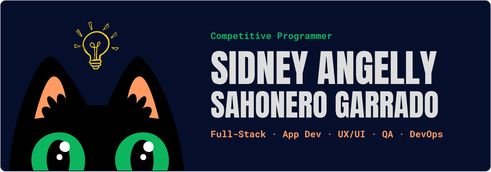

  <h1 align="center">
    
  </h1>
  

  

## 👋 About Me 

  

    
  

  Hey there! I'm a passionate full-stack developer who loves building modern, user-friendly web applications. I'm always eager to learn new technologies, explore creative solutions, and help others grow in tech.

🔭 Currently working on full-stack personal and collaborative projects.  
💻 Comfortable with both frontend (React, TailwindCSS) and backend (NestJS, Express).  
🎨 I also enjoy crafting intuitive UX/UI designs and performing testing & QA.  
📚 Always learning and experimenting to sharpen my skills and stay updated.  
🌐 Check out my projects: **[SiAn20](https://github.com/SiAn20)**  
✨ Excited about everything I'm building... and everything yet to come! 🚀  

### 💖 Support My Work

If you like my projects or find them helpful, you can support me through [**GitHub Sponsors**](https://github.com/sponsors/SiAn20).  
Your support motivates me to keep coding, creating, and sharing with the community! 🙌  

### 🌐 Portfolio

Want to see more of my work in action?  
Check out my portfolio here 👉 [**My Portfolio**](https://tu-dominio-o-link.netlify.app)  

## 
 Skills

## 📞 Connect With Me

  
    
  
  
  
  
  

## 📈 Github Stats

  

  
  

  

## 🎓 Certifications

<table>
  <tr>
    <td>
      <a href="https://platzi.com/p/sidneyangellysg/curso/2485-course/diploma/detalle/" target="_blank">
         
        <strong style="color:white;">Backend con Node.js</strong>
      </a>
    </td>
    <td align="center">
      <a href="https://platzi.com/p/sidneyangellysg/curso/2556-course/diploma/detalle/" target="_blank">
         
        <strong style="color:white;">Intro a React Native</strong>
      </a>
    </td>
    <td align="center">
      <a href="https://platzi.com/p/sidneyangellysg/curso/2558-course/diploma/detalle/" target="_blank">
         
        <strong style="color:white;">React Native: Forms & Deploy</strong>
      </a>
    </td>
    <td align="center">
      <a href="https://platzi.com/p/sidneyangellysg/curso/2557-course/diploma/detalle/" target="_blank">
         
        <strong style="color:white;">React Native: Lists & APIs</strong>
      </a>
    </td>
    <td align="center">
      <a href="#" target="_blank">
         
        <strong style="color:white;">Introducción a Redes</strong>
      </a>
    </td>
  </tr>
</table>
